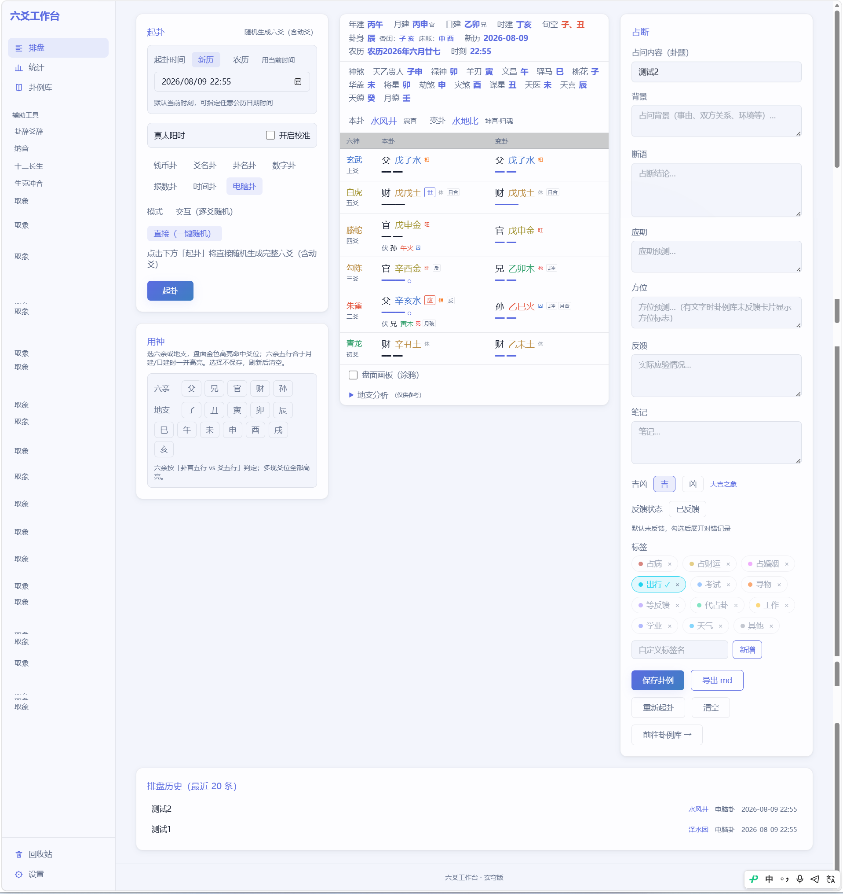
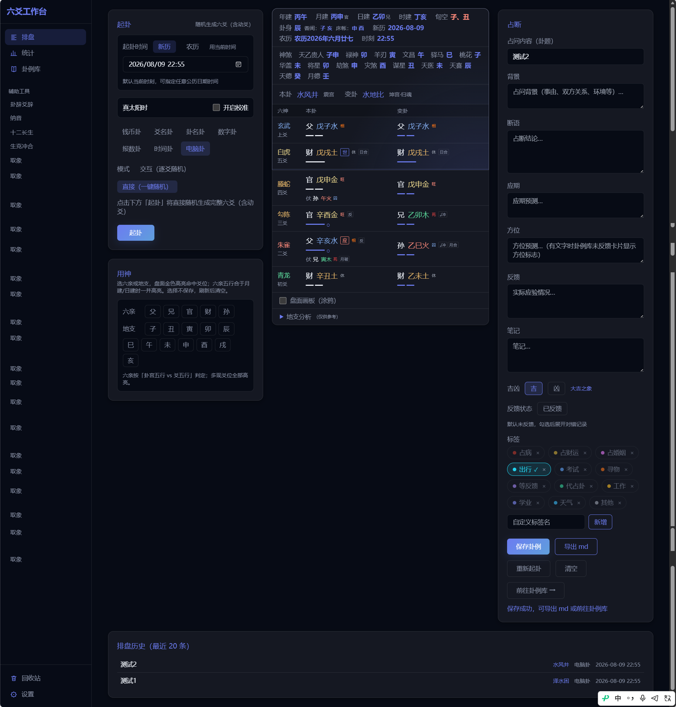
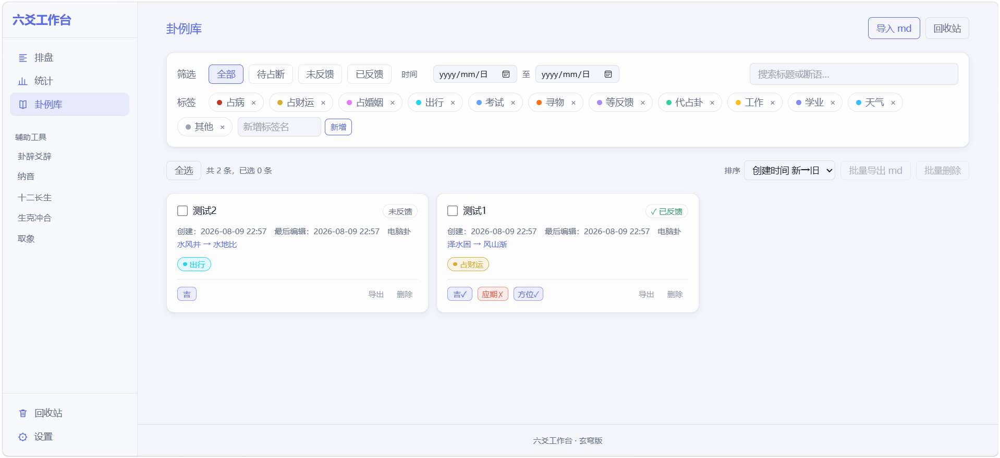
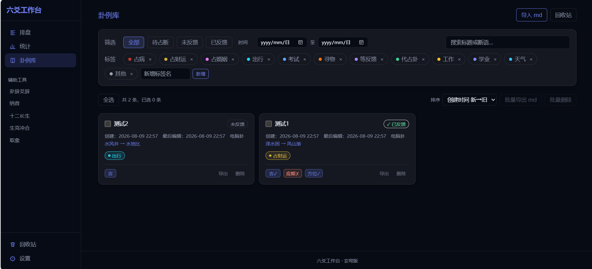
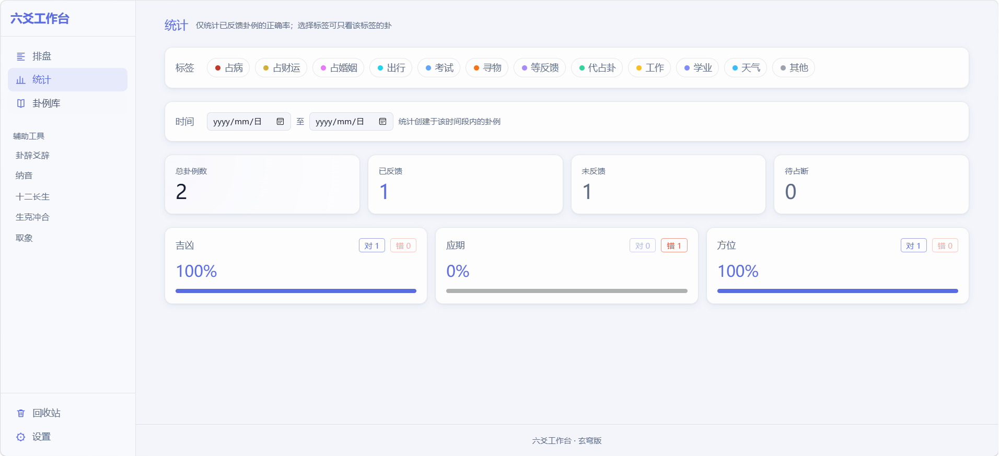
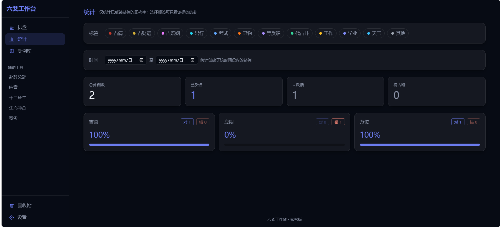
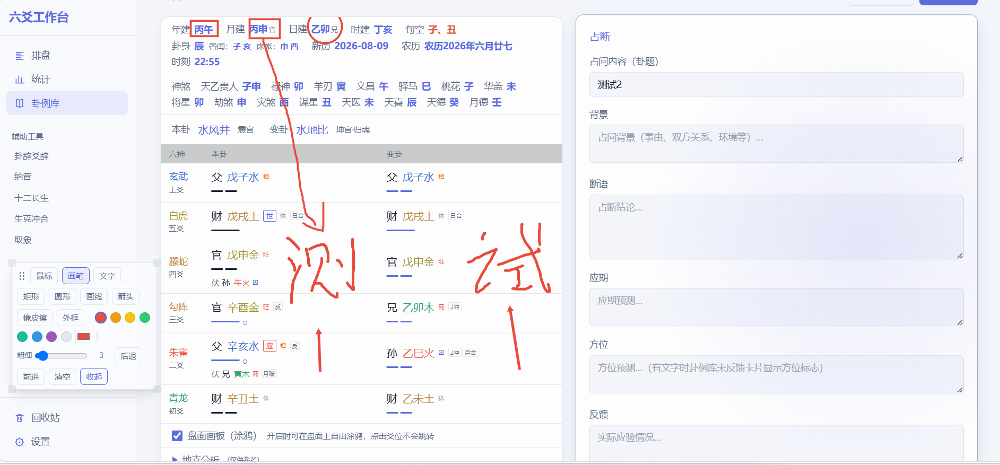
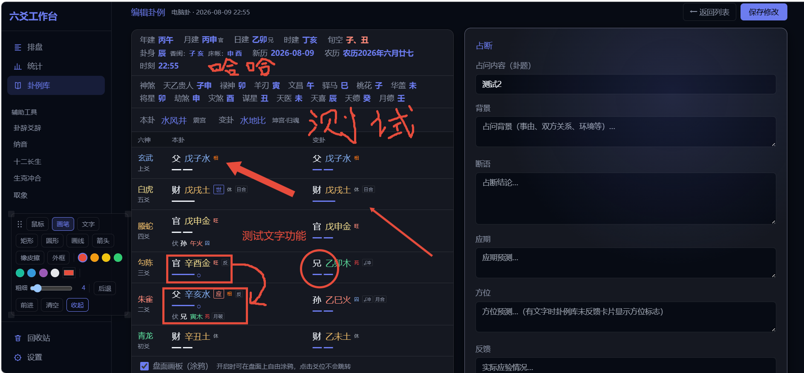

# 六爻工作台 · Liuyao Workbench

> **市面六爻工具只给你一张卦盘，六爻工作台给你一套完整的占断闭环——排盘 → 占断 → 应期 → 反馈 → 复盘，一卦一录，卦卦可考。**
>
> 天文级干支历法（VSOP87D 秒级精度）· 真太阳时 94 城校准 · 7 种起卦 · 数据本地存储 · Web / Windows / Android 三端

**版本 1.0.0（正式版）** · React 18 + Vite 5 + Tailwind CSS · IndexedDB 零后端

---

## 🎯 占断闭环（核心特色）

| 步骤 | 落地形态 |
|---|---|
| ① 起卦 | 7 种起卦方式：钱币 / 爻名 / 卦名 / 数字 / 报数 / 时间 / 电脑 |
| ② 占断 | 断语 / 应期 / 方位 / 反馈 / 吉凶五栏，与盘面同屏一气呵成 |
| ③ 反馈 | 已反馈对 / 错自动归入正确率统计；未反馈 / 待占断独立标记 |
| ④ 复盘 | 三维正确率（吉凶 / 应期 / 方位）+ 进度条 + 标签聚合 + 时间筛选，数字点击直接钻回卦例库 |

> 市面产品大多止步于①②。三维正确率 + 复盘闭环，是本项目区别于所有同类产品的根本。

---

## ✨ 亮点

### 📊 多维度统计与卦例库筛选
- **统计页**：四卡总览（总卦例 / 已反馈 / 未反馈 / 待占断）+ 三维正确率（吉凶 / 应期 / 方位）+ 标签多选筛选（任一命中）+ 创建时间范围筛选，数字一键钻取卦例库
- **卦例库**：状态筛选（全部 / 待占断 / 未反馈 / 已反馈）+ 创建时间范围 + 关键字搜索（标题 / 断语）+ 标签多选 + 排序；多选批量导出 md / 批量删除 / 回收站

### 🧭 天文级干支历法
- **二十四节气精确到秒**：VSOP87D 视黄经算法（对齐紫金山天文台口径），2022–2031 立春最大偏差 8.1 秒
- **真太阳时校准**：94 座城市两级下拉 + 均时差，日 / 时柱跟当地太阳，月 / 年柱跟全球节气
- **晚子时换日 23:00**：旬空 / 时柱同步跟随；五虎遁按立春后年干精确遁干

### 🛡 数据主权与隐私承诺
- **纯前端，零后端**：数据全部存本地 IndexedDB，不上传、不联网、不追踪
- **单文件 JSON 备份 / 恢复**，换电脑 / 换浏览器零成本迁移
- **隐私承诺**：未来若增加数据同步功能，**承诺只同步你的卦例与设置本身，绝不采集任何数据**——你的每一卦都只属于你
- 开源 MIT，免费无广告

### 🎨 玄穹主题
- 深空极光 + 玻璃拟态 + 卡片光标光斑；明暗双主题（浅色 / 跟随系统 / 深色三选）
- 五行配色保留传统语义（青龙木 / 朱雀火 / 勾陈土 / 螣蛇土 / 白虎金 / 玄武水）
- 触屏设备弱化动效，尊重 `prefers-reduced-motion`

### 🎨 画板涂鸦（边占边记）
- 手绘 / 箭头 / 矩形 / 圆形 / 文字五种工具，橡皮擦 / 外框 / 颜色 / 粗细
- 四角拖拽调形 + 粗细独立记忆
- **涂鸦 SVG 内嵌 Markdown，导出-导入完全可逆**
- 盘面与占断同屏涂鸦，不打断思路

### 🧮 专业排盘引擎
- 7 种起卦方式；完整呈现本卦 / 变卦 / 六神 / 六亲 / 世应 / 动爻 / 旺衰 / 伏神 / 旬空 / 卦身 / 神煞
- **地支深度分析**：本变五行化进退、月建临破合墓、日辰冲合三合、动爻生克、三合局、入墓、真空、六合六冲卦、元神忌神判定
- **自定用神**：六亲 / 地支二选一，金色高亮，伏神命中同样点亮
- **纳甲纳干**：按上下经卦各自纳甲（乾甲壬 / 坤乙癸 / 震庚 / 巽辛 / 坎戊 / 离己 / 艮丙 / 兑丁）

---

## 📸 项目截图

### 排盘与占断
<table>
<tr><td></td><td></td></tr>
</table>

### 卦例库
<table>
<tr><td></td><td></td></tr>
</table>

### 统计复盘
<table>
<tr><td></td><td></td></tr>
</table>

### 画板涂鸦
<table>
<tr><td></td><td></td></tr>
</table>

---

## ☕ 支持作者

六爻工作台完全**免费开源**。如果你觉得它帮到了你，欢迎请我喝杯茶——

你的每一份支持，都是我持续更新、完善功能的动力。

<table>
<tr><td align="center"><br/><b>支付宝</b></td><td align="center"><br/><b>微信</b></td></tr>
</table>

---

## 🚀 快速开始

### 在线体验（Web 版，无需安装）

🌐 **https://derek-zhang888.github.io/liuyao-workbench/**

> **iPhone / iPad**：用 Safari 打开上方链接 → 点分享 → 「添加到主屏幕」→ 即可像 App 一样全屏使用（支持离线缓存）。
> 数据保存在各自浏览器本地 IndexedDB，互不干扰。

### 本地运行

```bash
npm install
npm run dev      # http://localhost:5173
npm run build    # 生产构建
```

> 数据保存在浏览器 IndexedDB，无需服务器。清理浏览器数据前请先「设置 → 数据备份」导出 JSON。

### Windows / Android 版

- 直接下载安装包：见 [Releases](https://github.com/Derek-Zhang888/liuyao-workbench/releases)
- 或本地构建：`npm run tauri:build`（Windows exe）/ `npm run tauri:android:build`（Android APK）

---

## 🧪 测试与质量

```bash
npx vitest run   # 全量测试
```

- **497 项自动化测试全绿**，覆盖排盘引擎 / 干支历法 / 神煞 / 真太阳时 / 画板 / Markdown 双向 / 统计与页面交互
- Vite 生产构建 0 警告

---

## 📦 技术栈

| 层 | 技术 |
|---|---|
| 前端 | React 18 + Vite 5 + Tailwind CSS 3 |
| 存储 | IndexedDB |
| 桌面 / 移动 | Tauri v2（Rust） |
| 测试 | Vitest + Testing Library + jsdom |

---

## ⚠️ 已知限制

- 卦辞爻辞页展示原文，「解析」后续迭代补充
- 批量导出 md 为多文件下载，浏览器可能需允许
- 本地数据：换浏览器 / 清缓存前请定期导出 JSON 备份
- 历法对齐紫金山官方算法，个别边界日期以权威历书为准

---

## 📜 License

MIT License — 自由使用、修改与分发，保留版权声明即可。

---

## 🤝 加入交流

QQ 群 **1101761454**

> 欢迎加入六爻工作台交流群：反馈使用体验、提出改进建议，也是六爻爱好者交流心得的场所。你的每一条反馈，都是这个工具进步的方向。

---

*一卦一录，卦卦可考。愿这套工具陪你见证每一次起卦与应验。*
